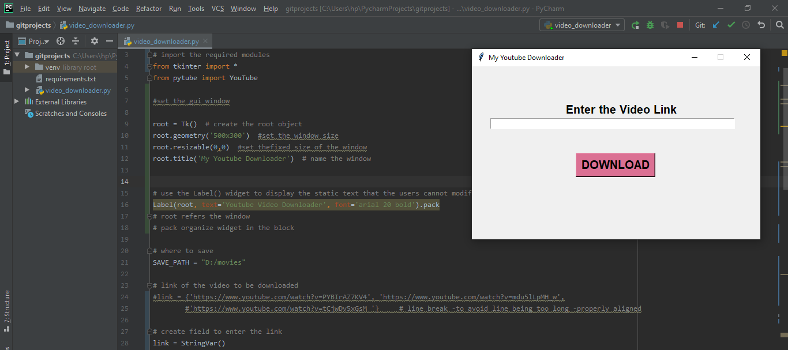

# Youtube-Video-Downloader
Downloads Youtube videos using 'pytube' and 'tkinter' libraries

# Description
This program provides a simple GUI for downloading single youtube video at a time.

Based on https://data-flair.training/blogs/python-youtube-downloader-with-pytube/

# Installation

First install the 'requirements.txt' file

```bash
pip install -r requirements.txt
```

Then suggest the location you need to save the video

Paste the link of the desired youtube video on the 'My Youtube Downloader' window.

# Results

'My Youtube Downloader' window may look like this




